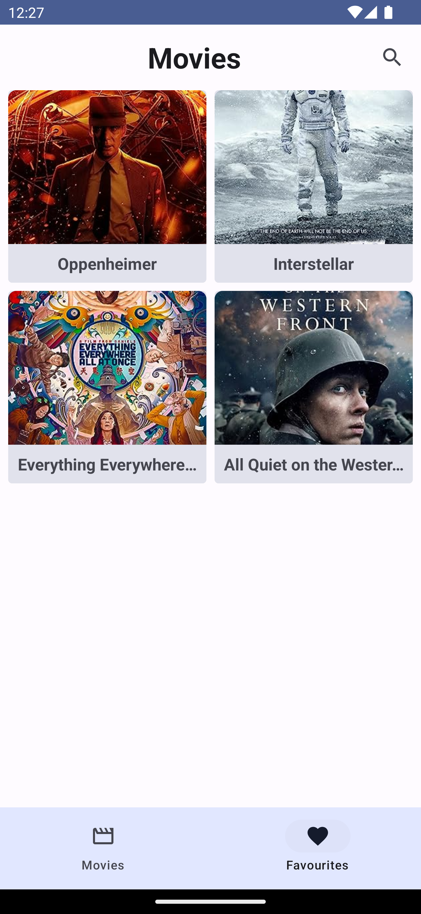
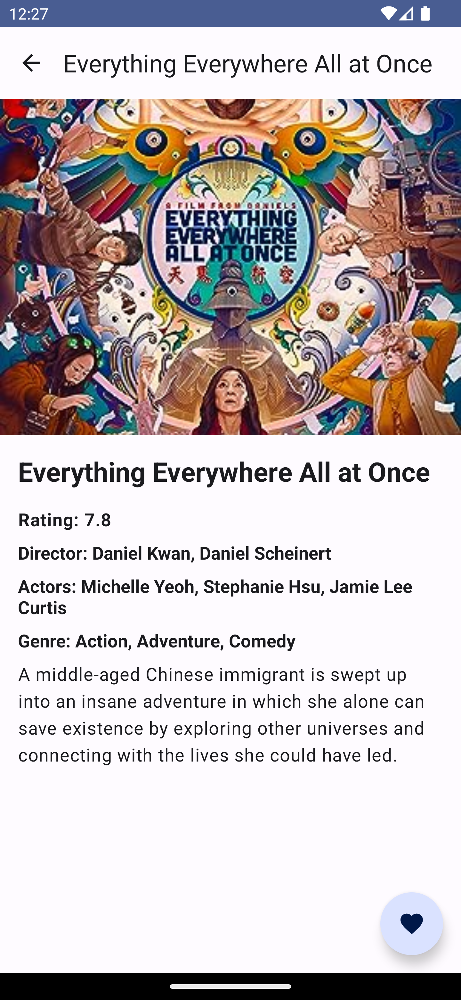
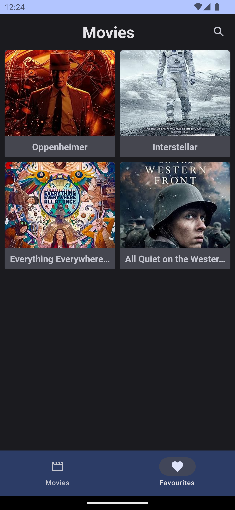
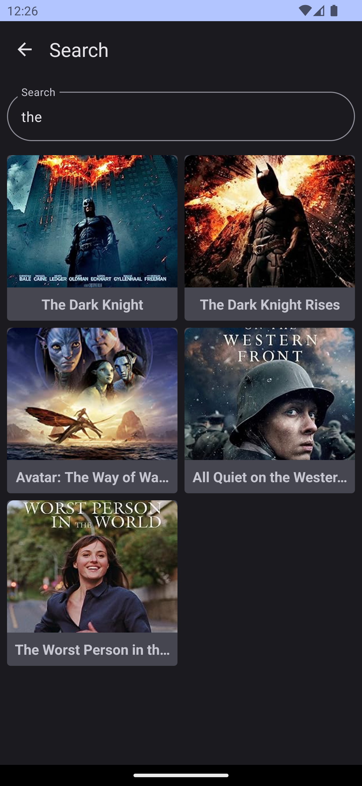
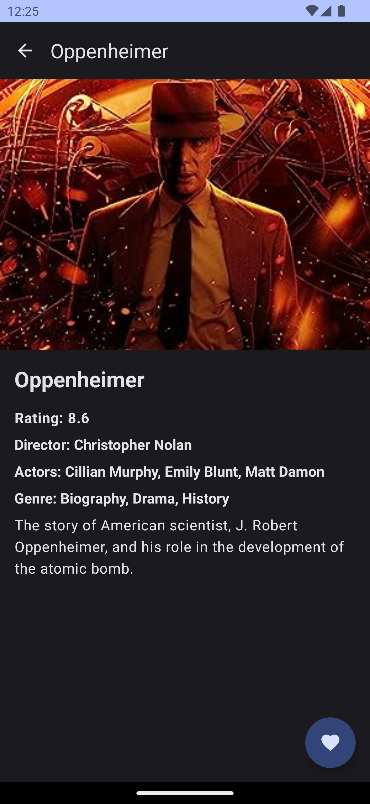

# MoviesComposeApp
An Android app that showcases MVVM Clean architecture with Jetpack Compose.

## Tech Stack

- Kotlin
- Jetpack Compose
- Coroutines + Flow for asynchronous
- MVVM Clean architecture
- Material Design 3 components
- StateFlow, SharedFlow and ViewModel
- Dagger Hilt - Dependency Injection
- Unit tests
- Instrumentation tests
- UI tests - Espresso
- Retrofit for Network calls
- Coil for image loading
- Dynamic theme

## Screenshots

| Movies Light | Favourites Light                                         | Search Light                                             | Details Light                                            | Movies Dark                                             | Favourites Dark                                         | Search Dark                                             | Details Dark                                            |
|--------------|----------------------------------------------------------|----------------------------------------------------------|----------------------------------------------------------|---------------------------------------------------------|---------------------------------------------------------|---------------------------------------------------------|---------------------------------------------------------|
|  |  |  |  |  |  |  |  |
